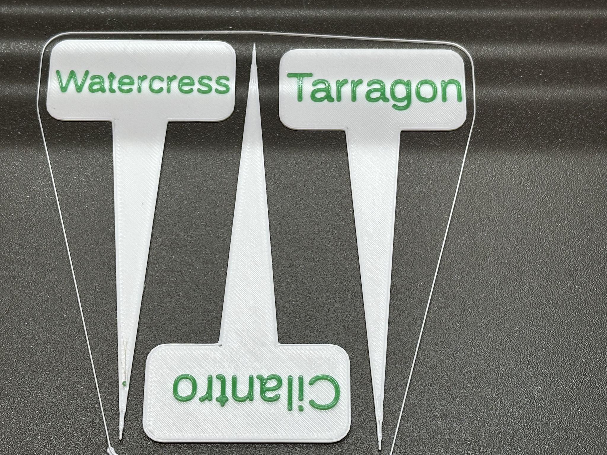
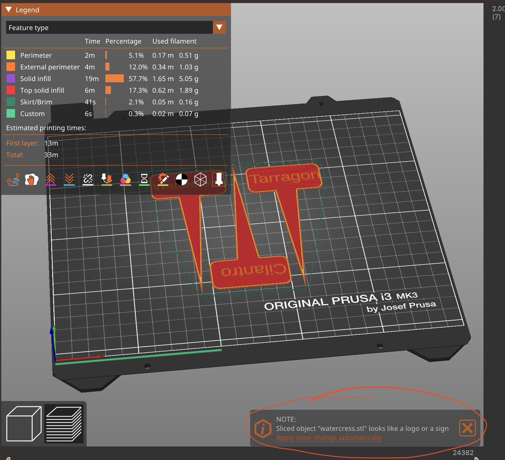
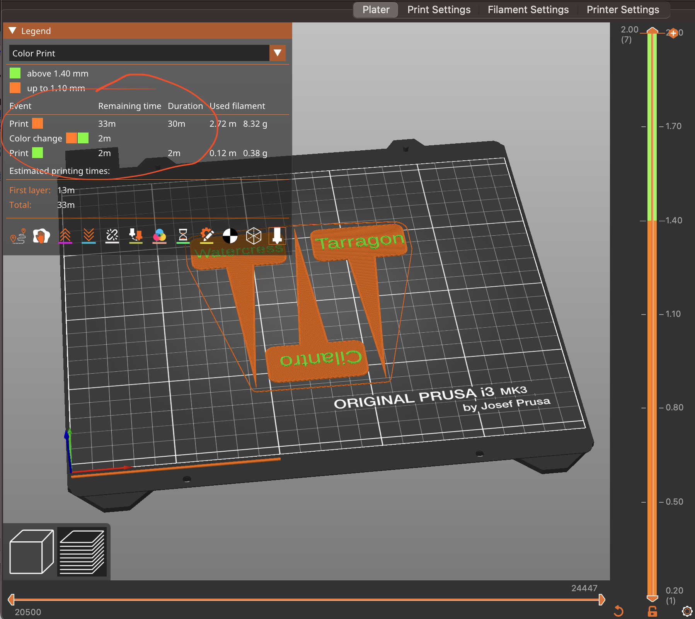

<!--
SPDX-FileCopyrightText: 2023 John Romkey

SPDX-License-Identifier: MIT
-->

# OpenSCAD Garden Signs

This is a simple OpenSCAD program to generate signs with raised text
to use in gardening. I print them in white with green text.

This repo includes pre-generated STL files for many plants in the
`stls` directory. Load the ones you want into your slicer, slice and
do whatever's needed for the filament change and print them.

## Customizing Signs

If you want to change the text or size of the signs, you'll need to
first [install OpenSCAD](https://openscad.org/downloads.html).

Once OpenSCAD is installed, have it load `garden-signs.scad`. You can
then preview your sign by using the `Render` button (F8 on macOS) and
export the STL file using the `Export as STL` button (F7 on macOS).

Change the dimensions of the sign by editing `garden-signs.scad`. All
dimensions are in mm.

- `width` - the horizontal dimension of the main part of the sign
- `height` - the vertical dimension of the main part of the sign
- `thickness` - the thickness of the main part of the sign

- `spike_width` - the horizontal dimension of the triangular support for the sign
- `spike_height` - the vertical dimension of the triangular support for the sign

You'll want to set the name for the kind of plant the sign is 
for. OpenSCAD has minimal support for strings and fonts, so first set
`name` to the plant name, do a preview of the sign, and change `scale`
as needed to fit the text on the sign. `.9` is 90% scale, `1.2` is
120%. Longer names will need smaller scales ("Watermelon fits at `.65`
or 65%), shorter names may want larger scales to more fully occupy the
space ("Peas" fits at `1.4` or 140%).

## Changing Text Color

PrusaSlicer automatically detects what appears to be text or a logo
and offers to insert instructions that will pause the printer for a
filament change.

To do this, slice your project and look in the lower right for a popup
that says "Sliced object looks like a logo or sign". CLick the "Apply
color change automatically" link and then slice your project *again*
and save the resulting gcode.

PrusaSlicer will then show you the estimated time to the filament change.

If you're using a different slicer or different printer you'll need to
check their documentation to see how to do this, if you can.

Once it's time to change the filament the printer will stop printing,
move the print head to the right front corner and start beeping. Be
sure to use the same type of filament - don't mix PLA and PETG, for
instance. Follow the printer's prompts to unload the original color
and load the new one.

The printer will extrude a small amount of filament as part of the
loading process. In my experience it then extrudes just a bit more
after you confirm that the new filament has loaded correct and before
resuming printing - it can be tricky removing this as the head starts
to move, but be sure to get it or else it may interefere with the
print.

Because the filament change can be annoying, consider batching up
several signs in one print if they're using the same colors.

## Running From The Command Line

You can also run OpenSCAD as a command-line utility without the
graphic user interface.

The shell script `generate.sh` should work on macOS and Linux. You'll
need to modify it to use the correct location for the OpenSCAD
binary. By default it uses the location for macOS.

OpenSCAD allows you to override the values of variables on the
command-line using the `-D` option, for instance, `-D name=Parsley`
will set the `name` variable to `Parsley`. If the name has a space in
it, enclose it in double quotes.  You can change multiple variables
by using multiple `-D` options.

See `generate.sh` for examples.

Under macOS it outputs this warning, which seems to be harmless.

Fontconfig warning: "/Applications/OpenSCAD.app/Contents/Resources/fonts/fonts.conf", line 84: unknown element "blank"

See also [Using OpenSCAD in a command line environment](https://files.openscad.org/documentation/manual/Using_OpenSCAD_in_a_command_line_environment.html)
